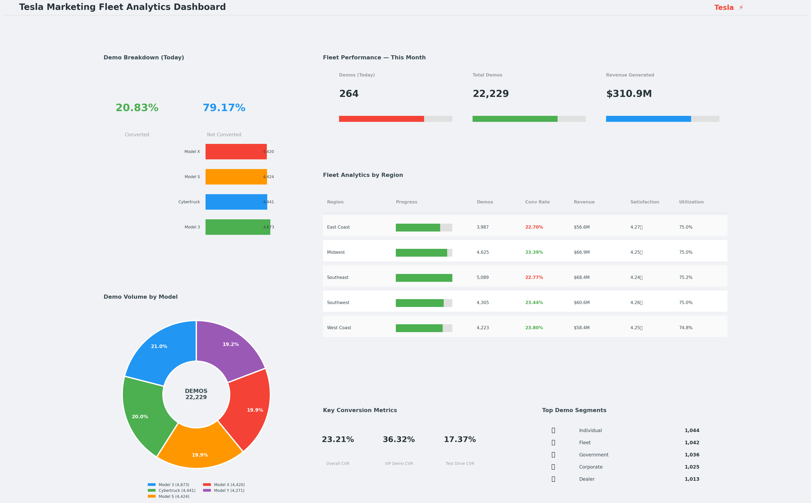

# Tesla Marketing Fleet Analytics Dashboard

An end-to-end marketing fleet analytics project analyzing demo drive 
performance, conversion rates, vehicle utilization, and revenue generation 
across 500 vehicles, 5 regions, and 22,229 demo records.

## Fleet Summary
- **Total Vehicles:** 500
- **Total Demo Records:** 22,229
- **Overall Conversion Rate:** 23.21%
- **Total Revenue Generated:** $310.89M
- **Avg Fleet Utilization:** 75.0%
- **Avg Customer Satisfaction:** 4.25/5.0

## Dashboard Visualizations

1. Demo Breakdown — Converted vs Not Converted (Today)
2. Fleet Performance KPIs — Demos, Total Records, Revenue
3. Fleet Analytics by Region — Progress bars, CVR, Revenue, Satisfaction
4. Demo Volume by Model — Donut Chart
5. Key Conversion Metrics — Overall, VIP Demo, Test Drive CVR
6. Top Demo Segments — Corporate, Individual, Fleet, Government

## Conversion Rates by Demo Type
| Demo Type | CVR |
|---|---|
| VIP Demo | ~35% |
| Corporate Demo | ~28% |
| Dealer Demo | ~22% |
| Test Drive | ~18% |
| Event Demo | ~12% |

## Vehicle Models
- Model 3, Model Y, Model S, Model X, Cybertruck

## Regions Covered
- West Coast, East Coast, Southwest, Midwest, Southeast

## Technologies
- Python, Pandas, NumPy
- Matplotlib
- Google Colab (T4 GPU)
